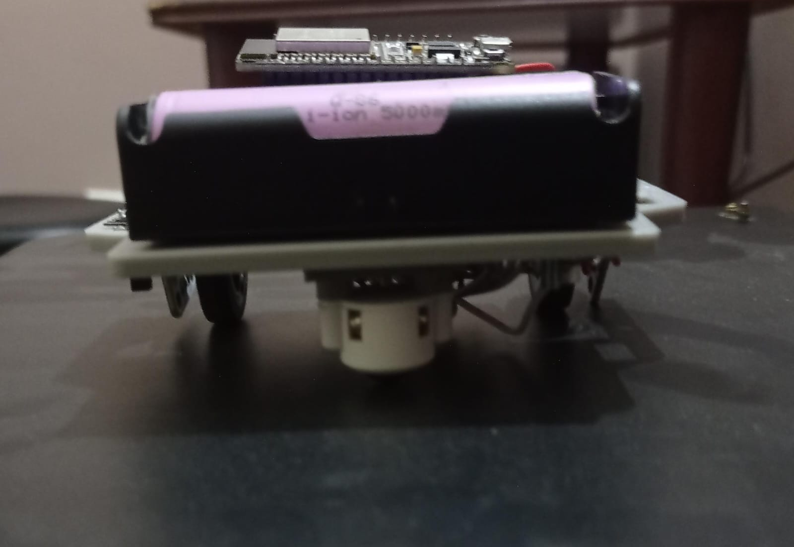
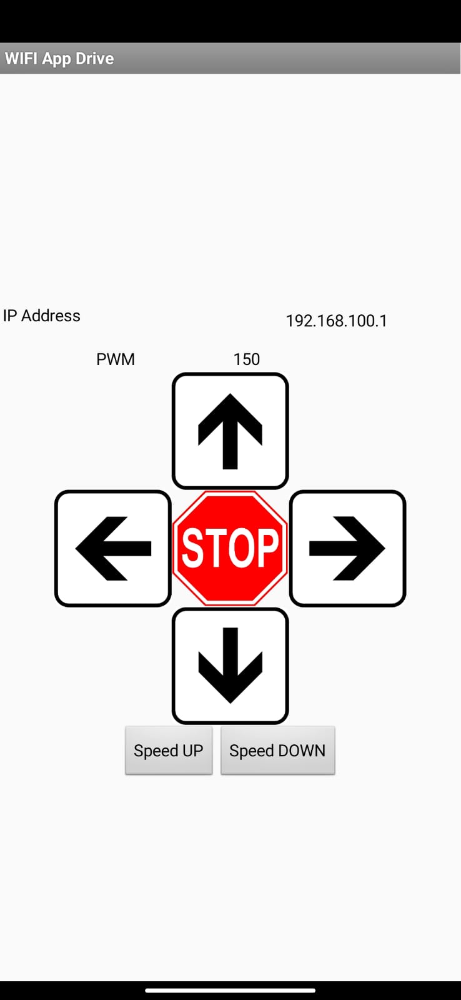

# WiFi Controlled Robot

This project involves creating a WiFi-controlled robot using an ESP32 microcontroller. The robot is designed to receive commands from a mobile app and perform various movements like forward, backward, left, right, and stop. It also allows you to control the speed of the robot.




## Table of Contents
- [Components](#components)
- [Setup](#setup)
- [Code Overview](#code-overview)
- [Usage](#usage)
- [Custom Libraries](#custom-libraries)
- [Contributors](#contributors)
- [License](#license)

## Components
### Hardware Components

- ESP32 microcontroller
- Motor wheels
- Custom-designed and printed robot frame
- Motor driver
- OLED Display
- Power source for the robot

### Software Components

- Platformio IDE with ESP32 support
- Custom libraries for motor control, WiFi communication, and OLED display
- MIT App Inventor for creating the mobile app
- Android APK for controlling the robot

## Setup

Follow these steps to set up the WiFi-controlled robot:

1. **Connect Hardware**: Wire up the ESP32, motors, and OLED display following the provided schematic or pinout.

2. **Flash Code**: Use PlatformIO to flash the provided code onto the ESP32 microcontroller.

3. **Install Mobile App**: Install the provided Android APK on your mobile device to control the robot.

4. **Power On**: Power on the robot.

5. **Connect to WiFi**: Establish a WiFi connection between the mobile app and the ESP32. Use the credentials provided in the mobile app.

6. **Control Robot**: Use the mobile app to send commands to the robot and observe its movements on the OLED display.

### Environment Setup

1. Clone this repository to your local development environment.

2. Install the required libraries for the ESP32 board and OLED display using PlatformIO. The configuration is provided in the `platformio.ini` file.

```ini
[env:esp32doit-devkit-v1]
platform = espressif32
board = esp32doit-devkit-v1
framework = arduino
monitor_speed = 115200
monitor_rts = 0
monitor_dtr = 0
monitor_port = /dev/ttyUSB0
lib_deps = adafruit/Adafruit SSD1306@^2.5.7
```

## Code Overview

- `wifi_data_processing.h`: Handles WiFi communication and data processing from the mobile app.
- `motor_control.h`: Contains functions for controlling the robot's motors (e.g., forward, backward, left, right).
- `oled_display.h`: Manages the OLED display for showing robot status.

The main `setup()` function initializes the hardware components, including motors, WiFi, and the OLED display. The `loop()` function continuously processes incoming commands from the mobile app and controls the robot's movements accordingly.

## Usage

1. **Connect to Robot's WiFi**: Connect to the robot's WiFi network using the credentials provided in the mobile app.

2. **Open Mobile App**: Open the mobile app and establish a connection with the robot.

3. **Control Robot**: Use the app's interface to send commands to the robot, such as moving forward, backward, or adjusting its speed.

4. **Observe Movements**: Observe the robot's movements on its OLED display.

## Custom Libraries

This project uses custom libraries for specific functionalities. Ensure that these libraries are included in your development environment:

1. `motor_control`: Provides functions for controlling the motors.
2. `wifi_communication`: Handles WiFi communication and client-server interactions.
3. `oled_display`: Manages the OLED display for status updates.

### Motor_Control Library

#### Overview

The `motor_control` library is responsible for controlling the robot's motors. It provides functions for moving the robot forward, backward, left, right, and stopping it. Additionally, you can adjust the motor speed using this library.

#### Installation

To use the `motor_control` library, include it in your Platformio project and call the `motor_setup()` function in your `setup()` to initialize the motors.

```arduino
#include "motor_control.h"

void setup() {
  motor_setup();
  // Your other setup code
}
```
#### Functions
```cpp
void forward(int speed);
void reverse(int speed);
void stop();
void right(int speed);
void left(int speed);
void motor_setup();
```
### Wifi_Communication Library

#### Overview

The `wifi_communication` library handles WiFi communication between the robot and a mobile app. It sets up the WiFi connection and manages client-server interactions.

#### Installation

To use the `wifi_communication` library, include it in your Platformio project and call the `setupWiFi()` function in your `setup()` to establish the WiFi connection.

```arduino
#include "wifi_data_processing.h"

void setup() {
  setupWiFi();
  // Your other setup code
}
```
#### Functions
```cpp
void setupWiFi();
void processClientRequest();
```

### Oled_display Library

#### Overview

The `oled_display` library is responsible for managing the OLED display on the robot. It provides functions for drawing arrow icons on the display to indicate the robot's movement direction.

#### Installation

To use the `oled_display` library, include it in your Platformio project.
```arduino
#include "oled_display.h"

```
#### Functions
```cpp
void drawRightArrow();
void drawLeftArrow();
void drawForwardArrow();
void drawBackwardArrow();
void drawStopCircle();
```
## Contributors

- Ibrahim
- Muhammad Luqman
- Khubaib

## License

This project is licensed under the MITLicense. See the `LICENSE.md` file for details.
